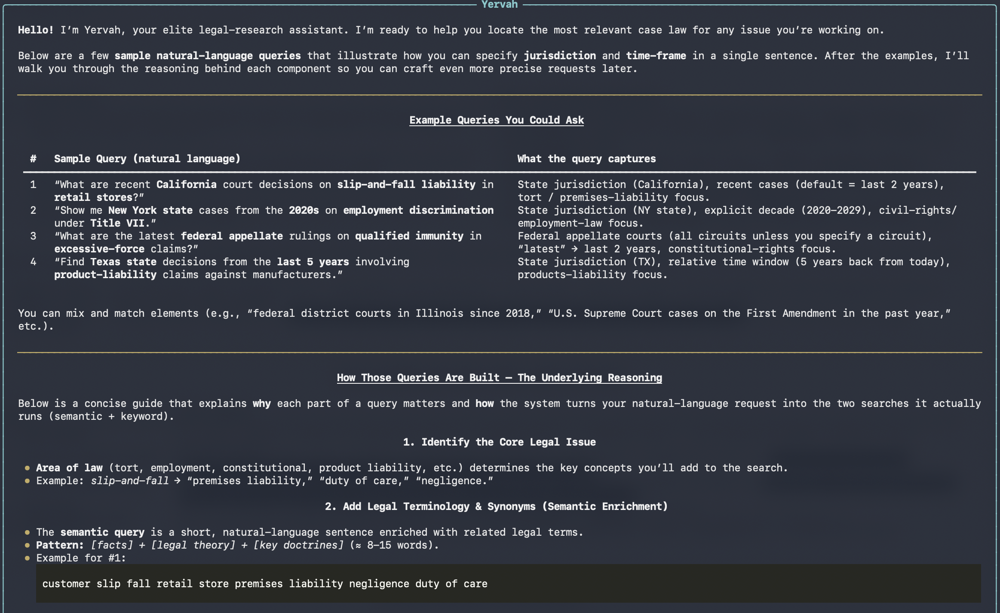

# Yevrah Terminal - AI-Enabled Research Tool

A terminal application for searching case law using the CourtListener API with dual search strategy (keyword + semantic).

## Demo

[](https://www.loom.com/share/e9e4ca6fcab546a8a537873ecd237ade)

**[▶️ Watch the full demo](https://www.loom.com/share/e9e4ca6fcab546a8a537873ecd237ade)** - See Yevrah in action with a complete workflow demonstration

## What It Does

Yevrah takes a natural language query, interprets it using an LLM, and executes dual searches against CourtListener's database of millions of court opinions:

1. **User inputs query** - Natural language describing their legal research need
2. **LLM interprets query** - Groq (groq/compound) extracts search parameters and formulates two queries
3. **Dual search executes** - Runs keyword (BM25) and semantic (vector) searches in parallel
4. **Results displayed** - Top 5 keyword + top 5 semantic results (10 total) with source tags
5. **Optional opinion analysis** - User can select any result to fetch and analyze the full opinion text

## How Search Works

### Query Interpretation (Groq LLM)
The LLM receives your query and extracts:
- **Semantic query** - Natural language for semantic search
- **Keyword query** - Boolean operators and exact terms for keyword search
- **Jurisdiction** - Court codes (e.g., "California" → `cal calctapp ca9 cand cacd casd`)
- **Date range** - Parsed from natural language (e.g., "last 5 years" → `filed_after: 2020-01-10`)

**Boolean Operator Handling:**
If you use [CourtListener Boolean operators](https://www.courtlistener.com/help/search-operators/) (`AND`, `OR`, `NOT`, `&`, `%`) in your query:
- Your exact query with operators is used for **keyword search** (preserves Boolean logic)
- A natural language version is automatically generated for **semantic search** (better vector matching)

Example: `"employment AND discrimination"` becomes:
- Keyword: `"employment AND discrimination"` (exact Boolean)
- Semantic: `"employment discrimination"` (natural language)

This ensures both search strategies get queries in their optimal format.

### Dual Search Strategy
**Both searches run in parallel:**

**Keyword Search (BM25):**
- Uses Boolean operators and exact term matching
- Returns 20 results from CourtListener
- Shows top 5 by BM25 relevance score
- No reranking - trusts CourtListener's scoring

**Semantic Search (Vector):**
- Uses natural language and concept matching
- Returns 20 results from CourtListener's vector index
- Reranks all 20 results using Cohere rerank-v4.0-fast (if API key available)
- Shows top 5 after reranking
- Falls back to CourtListener's order if no Cohere key

### Result Display
- **10 total results** (5 keyword + 5 semantic)
- Each result tagged with source: **KEYWORD** (yellow) or **SEMANTIC** (green)
- No deduplication - see separate results from each approach
- Results display: case name, court, date, citation, snippet, relevance scores

## Requirements

- **Python 3.8+**
- **GROQ_API_KEY** - Required (get from https://console.groq.com/)
- **COURTLISTENER_API_KEY** - Required (get from https://www.courtlistener.com/api/rest-info/)
- **COHERE_API_KEY** - Optional (get from https://cohere.com/) - enables semantic reranking

## Setup

1. **Clone and navigate to directory:**
   ```bash
   git clone https://github.com/legaltextai/yevrah_terminal.git
   cd yevrah_terminal
   ```

2. **Create virtual environment:**
   ```bash
   python3 -m venv venv
   source venv/bin/activate  # On Windows: venv\Scripts\activate
   ```

3. **Install dependencies:**
   ```bash
   pip install -r requirements.txt
   ```

4. **Create `.env` file with API keys:**
   ```bash
   GROQ_API_KEY=your_groq_key_here
   COURTLISTENER_API_KEY=your_courtlistener_key_here
   COHERE_API_KEY=your_cohere_key_here  # Optional - for semantic reranking
   ```

5. **Run:**
   ```bash
   python main.py
   ```

## Usage Examples

### Natural Language Query
```
You: customer slip fall store florida last 3 years

[Dual search executes in parallel]

Keyword Search API: https://www.courtlistener.com/api/rest/v4/search/?q=...&semantic=false
Semantic Search API: https://www.courtlistener.com/api/rest/v4/search/?q=...&semantic=true

━━━━━━━━━━━━━━━━━━━━━━━━━━━━━━━━━━━━━━━━━━━━━━
         Dual (Keyword + Semantic) Search
━━━━━━━━━━━━━━━━━━━━━━━━━━━━━━━━━━━━━━━━━━━━━━

┌─ #1 KEYWORD ─────────────────────────────────┐
│ Case Name: Smith v. Publix Super Markets     │
│ Court: Florida Supreme Court                 │
│ Date Filed: 2022-03-15                       │
│ Citation: 350 So. 3d 123                     │
│ Snippet: Customer slipped on wet floor...    │
│ Relevance: BM25: 15.32                       │
└──────────────────────────────────────────────┘

[... 4 more keyword results ...]

┌─ #6 SEMANTIC ────────────────────────────────┐
│ Case Name: Jones v. Walmart Stores, Inc.    │
│ Court: Florida District Court of Appeal     │
│ Date Filed: 2023-01-20                       │
│ Citation: 360 So. 3d 456                     │
│ Snippet: Premises liability for customer... │
│ Relevance: Semantic: 0.87                    │
└──────────────────────────────────────────────┘

[... 4 more semantic results ...]

Enter a number (1-10) to analyze any opinion in detail, or describe what else you'd like to search for.
```

### Boolean Operator Query
```
You: employment AND discrimination, california

[System detects Boolean operators and optimizes for each search type]

╭─────────────────────── Search Parameters ───────────────────────╮
│ Dual (Keyword + Semantic) Search                                │
│ Keyword Query: "employment AND discrimination"                   │
│ Semantic Query: "employment discrimination"                      │
│ Jurisdiction: cal calctapp ca9 cacd caed cand casd              │
╰──────────────────────────────────────────────────────────────────╯

[Results display with 5 keyword + 5 semantic results]
```

**Note:** When you use Boolean operators (`AND`, `OR`, `NOT`, `&`, `%`), the system automatically:
- Preserves your exact Boolean query for keyword search
- Converts it to natural language for semantic search
- This gives you the best of both approaches!

## Commands

| Command | Action |
|---------|--------|
| `exit`, `quit`, `q` | Exit application |
| `new`, `reset` | Start new search session |
| `help` | Show help information |
| `jurisdictions` | List all available court codes |
| `1-10` | Analyze full opinion for result #1-10 |

## Jurisdiction Mapping

The LLM automatically maps natural language to CourtListener court codes:

| You Say | Court Codes |
|---------|-------------|
| "California" | `cal calctapp ca9 cand cacd casd caed` |
| "California state" | `cal calctapp` |
| "Ninth Circuit" | `ca9` |
| "New York federal" | `ca2 nysd edny ndny wdny` |
| "Supreme Court" | `scotus` |
| "Florida" | `fla flactapp ca11 flsd flmd flnd` |

See `jurisdictions.py` for the complete list of court codes.

## Architecture

### Modular Design Philosophy

Yevrah is designed with an idea to become in the future a **modular system** that can be extended and adapted to different use cases. The goal is to allow for:

- **Multiple tool integrations** - Connect various APIs and data sources beyond CourtListener
- **Multi-agent orchestration** - Coordinate specialized agents with different skills and capabilities
- **Evaluation mechanisms** - Built-in testing and validation frameworks for quality assurance
- **Pluggable components** - Swap out LLM providers, search backends, or reranking services

This modular approach should enable researchers, developers, and legal tech teams to customize the system for their specific needs while maintaining a clean, maintainable codebase.

### Current Flow

```
User Input
    ↓
Groq LLM (groq/compound)
    ├─ Extracts: semantic query, keyword query, jurisdiction, dates
    └─ Calls: execute_search_case_law tool
         ↓
CourtListener API (parallel execution)
    ├─ Keyword Search (20 results) → Top 5 by BM25
    └─ Semantic Search (20 results) → Cohere rerank → Top 5
         ↓
Display: 10 results with source tags (KEYWORD/SEMANTIC)
    ↓
User selects result # → Fetch full opinion → LLM analysis
```

## Files

| File | Purpose |
|------|---------|
| `main.py` | Entry point, main conversation loop |
| `llm_client.py` | Groq API client, system prompts, tool calling |
| `tools.py` | Tool definitions, dual search logic, jurisdiction mapping, date parsing |
| `courtlistener.py` | CourtListener API client (keyword & semantic search) |
| `reranker.py` | Cohere rerank integration for semantic results |
| `formatter.py` | Terminal UI formatting with Rich library |
| `jurisdictions.py` | Court code reference (200+ courts) |

## Models Used

| Component | Model | Purpose |
|-----------|-------|---------|
| Query interpretation |  Groq groq/compound | Extract search params, formulate queries |
| Opinion analysis |  Groq groq/compound | Analyze full opinion text |
| Keyword search | CourtListener BM25 | Traditional Boolean + exact term matching |
| Semantic search | CourtListener vectors | Concept-based similarity search |
| Semantic reranking | Cohere rerank-v4.0-fast | Reorder semantic results by relevance |

## API References

- [CourtListener API Documentation](https://www.courtlistener.com/help/api/rest/)
- [CourtListener Search Endpoint](https://www.courtlistener.com/help/api/rest/search/)
- [CourtListener Jurisdictions](https://www.courtlistener.com/help/api/jurisdictions/)
- [Groq API Documentation](https://console.groq.com/docs)
- [Cohere Rerank Documentation](https://docs.cohere.com/docs/rerank)

## Contributing

We welcome contributions to Yevrah! Whether you're interested in:

- **Core legal logic** - Improving jurisdiction mapping, date parsing, or search strategies
- **New integrations** - Adding support for additional legal databases or APIs
- **Multi-agent features** - Building specialized agents for different legal research tasks
- **Testing and evaluation** - Enhancing the test suite and validation mechanisms
- **Documentation** - Improving guides and examples

If you'd like to contribute or have feedback about the project, please reach out to **admin@legaltext.ai**

## License

This repository is available under the permissive BSD license, making it easy and safe to incorporate in your own libraries. Links and mentions of LegalTextLab / legaltext.dev are much appreciated.
